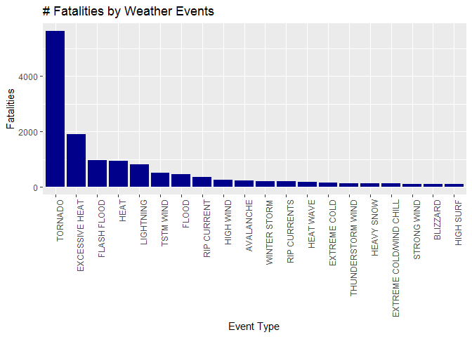
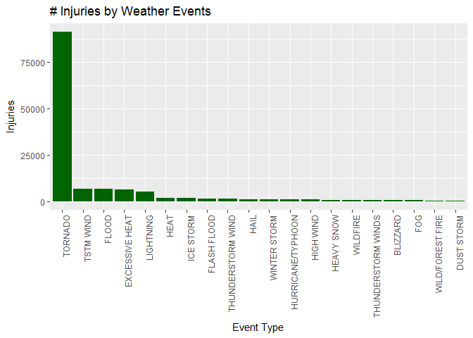
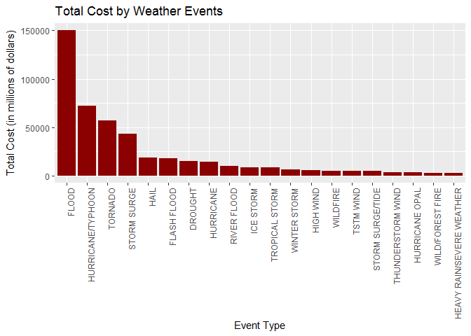

Reproducible Research: Course Project 2: Storm Events Data Analysis
================
friedoutkombii
15/06/2017

Synopsis
========

The dataset used here is the U.S. National Oceanic and Atmospheric Administration's (NOAA) storm database which contains events from 1950 to 2011 (Can be found [here](https://d396qusza40orc.cloudfront.net/repdata%2Fdata%2FStormData.csv.bz2)). This data contains storm event data as well as impact data including injuries, fatalities, property damage and crop damage among others. We will use this data to answer two questions:

-   Q1. Across the United States, which types of events (as indicated in the EVTYPE variable) are most harmful with respect to population health?

-   Q2. Across the United States, which types of events have the greatest economic consequences?

The conclusion reached by the analysis is that the weather event with the largest injuries & fatalities is tornadoes. The weather event with the greatest total damage cost worked out to be floods, followed by hurricane and typhoons. Further analysis can be done about these weather types and their impacts but this study is limited in scope.

Data Processing
===============

Load library

``` r
library(ggplot2)
```

Loading the data in R Studio

``` r
file="C:/Users/Nicholas/Documents/repdata%2Fdata%2FStormData.csv.bz2"
data<- read.csv(bzfile(file),header=TRUE)
dim(data)
```

Looking at the `dim(data)` we see that we have 37 columns (variables) and 902297 rows or instances

``` r
summary(data)
```

    ##     STATE__                  BGN_DATE             BGN_TIME     
    ##  Min.   : 1.0   5/25/2011 0:00:00:  1202   12:00:00 AM: 10163  
    ##  1st Qu.:19.0   4/27/2011 0:00:00:  1193   06:00:00 PM:  7350  
    ##  Median :30.0   6/9/2011 0:00:00 :  1030   04:00:00 PM:  7261  
    ##  Mean   :31.2   5/30/2004 0:00:00:  1016   05:00:00 PM:  6891  
    ##  3rd Qu.:45.0   4/4/2011 0:00:00 :  1009   12:00:00 PM:  6703  
    ##  Max.   :95.0   4/2/2006 0:00:00 :   981   03:00:00 PM:  6700  
    ##                 (Other)          :895866   (Other)    :857229  
    ##    TIME_ZONE          COUNTY           COUNTYNAME         STATE       
    ##  CST    :547493   Min.   :  0.0   JEFFERSON :  7840   TX     : 83728  
    ##  EST    :245558   1st Qu.: 31.0   WASHINGTON:  7603   KS     : 53440  
    ##  MST    : 68390   Median : 75.0   JACKSON   :  6660   OK     : 46802  
    ##  PST    : 28302   Mean   :100.6   FRANKLIN  :  6256   MO     : 35648  
    ##  AST    :  6360   3rd Qu.:131.0   LINCOLN   :  5937   IA     : 31069  
    ##  HST    :  2563   Max.   :873.0   MADISON   :  5632   NE     : 30271  
    ##  (Other):  3631                   (Other)   :862369   (Other):621339  
    ##                EVTYPE         BGN_RANGE           BGN_AZI      
    ##  HAIL             :288661   Min.   :   0.000          :547332  
    ##  TSTM WIND        :219940   1st Qu.:   0.000   N      : 86752  
    ##  THUNDERSTORM WIND: 82563   Median :   0.000   W      : 38446  
    ##  TORNADO          : 60652   Mean   :   1.484   S      : 37558  
    ##  FLASH FLOOD      : 54277   3rd Qu.:   1.000   E      : 33178  
    ##  FLOOD            : 25326   Max.   :3749.000   NW     : 24041  
    ##  (Other)          :170878                      (Other):134990  
    ##          BGN_LOCATI                  END_DATE             END_TIME     
    ##               :287743                    :243411              :238978  
    ##  COUNTYWIDE   : 19680   4/27/2011 0:00:00:  1214   06:00:00 PM:  9802  
    ##  Countywide   :   993   5/25/2011 0:00:00:  1196   05:00:00 PM:  8314  
    ##  SPRINGFIELD  :   843   6/9/2011 0:00:00 :  1021   04:00:00 PM:  8104  
    ##  SOUTH PORTION:   810   4/4/2011 0:00:00 :  1007   12:00:00 PM:  7483  
    ##  NORTH PORTION:   784   5/30/2004 0:00:00:   998   11:59:00 PM:  7184  
    ##  (Other)      :591444   (Other)          :653450   (Other)    :622432  
    ##    COUNTY_END COUNTYENDN       END_RANGE           END_AZI      
    ##  Min.   :0    Mode:logical   Min.   :  0.0000          :724837  
    ##  1st Qu.:0    NA's:902297    1st Qu.:  0.0000   N      : 28082  
    ##  Median :0                   Median :  0.0000   S      : 22510  
    ##  Mean   :0                   Mean   :  0.9862   W      : 20119  
    ##  3rd Qu.:0                   3rd Qu.:  0.0000   E      : 20047  
    ##  Max.   :0                   Max.   :925.0000   NE     : 14606  
    ##                                                 (Other): 72096  
    ##            END_LOCATI         LENGTH              WIDTH         
    ##                 :499225   Min.   :   0.0000   Min.   :   0.000  
    ##  COUNTYWIDE     : 19731   1st Qu.:   0.0000   1st Qu.:   0.000  
    ##  SOUTH PORTION  :   833   Median :   0.0000   Median :   0.000  
    ##  NORTH PORTION  :   780   Mean   :   0.2301   Mean   :   7.503  
    ##  CENTRAL PORTION:   617   3rd Qu.:   0.0000   3rd Qu.:   0.000  
    ##  SPRINGFIELD    :   575   Max.   :2315.0000   Max.   :4400.000  
    ##  (Other)        :380536                                         
    ##        F               MAG            FATALITIES          INJURIES        
    ##  Min.   :0.0      Min.   :    0.0   Min.   :  0.0000   Min.   :   0.0000  
    ##  1st Qu.:0.0      1st Qu.:    0.0   1st Qu.:  0.0000   1st Qu.:   0.0000  
    ##  Median :1.0      Median :   50.0   Median :  0.0000   Median :   0.0000  
    ##  Mean   :0.9      Mean   :   46.9   Mean   :  0.0168   Mean   :   0.1557  
    ##  3rd Qu.:1.0      3rd Qu.:   75.0   3rd Qu.:  0.0000   3rd Qu.:   0.0000  
    ##  Max.   :5.0      Max.   :22000.0   Max.   :583.0000   Max.   :1700.0000  
    ##  NA's   :843563                                                           
    ##     PROPDMG          PROPDMGEXP        CROPDMG          CROPDMGEXP    
    ##  Min.   :   0.00          :465934   Min.   :  0.000          :618413  
    ##  1st Qu.:   0.00   K      :424665   1st Qu.:  0.000   K      :281832  
    ##  Median :   0.00   M      : 11330   Median :  0.000   M      :  1994  
    ##  Mean   :  12.06   0      :   216   Mean   :  1.527   k      :    21  
    ##  3rd Qu.:   0.50   B      :    40   3rd Qu.:  0.000   0      :    19  
    ##  Max.   :5000.00   5      :    28   Max.   :990.000   B      :     9  
    ##                    (Other):    84                     (Other):     9  
    ##       WFO                                       STATEOFFIC    
    ##         :142069                                      :248769  
    ##  OUN    : 17393   TEXAS, North                       : 12193  
    ##  JAN    : 13889   ARKANSAS, Central and North Central: 11738  
    ##  LWX    : 13174   IOWA, Central                      : 11345  
    ##  PHI    : 12551   KANSAS, Southwest                  : 11212  
    ##  TSA    : 12483   GEORGIA, North and Central         : 11120  
    ##  (Other):690738   (Other)                            :595920  
    ##                                                                                                                                                                                                     ZONENAMES     
    ##                                                                                                                                                                                                          :594029  
    ##                                                                                                                                                                                                          :205988  
    ##  GREATER RENO / CARSON CITY / M - GREATER RENO / CARSON CITY / M                                                                                                                                         :   639  
    ##  GREATER LAKE TAHOE AREA - GREATER LAKE TAHOE AREA                                                                                                                                                       :   592  
    ##  JEFFERSON - JEFFERSON                                                                                                                                                                                   :   303  
    ##  MADISON - MADISON                                                                                                                                                                                       :   302  
    ##  (Other)                                                                                                                                                                                                 :100444  
    ##     LATITUDE      LONGITUDE        LATITUDE_E     LONGITUDE_    
    ##  Min.   :   0   Min.   :-14451   Min.   :   0   Min.   :-14455  
    ##  1st Qu.:2802   1st Qu.:  7247   1st Qu.:   0   1st Qu.:     0  
    ##  Median :3540   Median :  8707   Median :   0   Median :     0  
    ##  Mean   :2875   Mean   :  6940   Mean   :1452   Mean   :  3509  
    ##  3rd Qu.:4019   3rd Qu.:  9605   3rd Qu.:3549   3rd Qu.:  8735  
    ##  Max.   :9706   Max.   : 17124   Max.   :9706   Max.   :106220  
    ##  NA's   :47                      NA's   :40                     
    ##                                            REMARKS           REFNUM      
    ##                                                :287433   Min.   :     1  
    ##                                                : 24013   1st Qu.:225575  
    ##  Trees down.\n                                 :  1110   Median :451149  
    ##  Several trees were blown down.\n              :   569   Mean   :451149  
    ##  Trees were downed.\n                          :   446   3rd Qu.:676723  
    ##  Large trees and power lines were blown down.\n:   432   Max.   :902297  
    ##  (Other)                                       :588294

Looking at the summary it is apparent we have too many columns of data to deal with. For the assignment questions we will only need to cherry pick particular columns. These are below:

-   EVTYPE as a measure of event type (e.g. tornado, flood, etc.)
-   FATALITIES as a measure of harm to human health
-   INJURIES as a measure of harm to human health
-   PROPDMG as a measure of property damage and hence economic damage in USD
-   PROPDMGEXP as a measure of magnitude of property damage (e.g. thousands, millions USD, etc.)
-   CROPDMG as a measure of crop damage and hence economic damage in USD
-   CROPDMGEXP as a measure of magnitude of crop damage (e.g. thousands, millions USD, etc.)

To make our dataset smaller and easier to work with we will subset this data and name it `cutdata`.

``` r
cutdata<-data[,c('EVTYPE', 'FATALITIES', 'INJURIES', 'PROPDMG', 'PROPDMGEXP','CROPDMG', 'CROPDMGEXP')]
```

Let us check the first 5 rows of cutdata to check it's accurate.

``` r
head(cutdata,5)
```

    ##    EVTYPE FATALITIES INJURIES PROPDMG PROPDMGEXP CROPDMG CROPDMGEXP
    ## 1 TORNADO          0       15    25.0          K       0           
    ## 2 TORNADO          0        0     2.5          K       0           
    ## 3 TORNADO          0        2    25.0          K       0           
    ## 4 TORNADO          0        2     2.5          K       0           
    ## 5 TORNADO          0        2     2.5          K       0

We need to establish what our property and crop damage are in terms of dollars. Right now each is split into two columns. The value, and then a mutiplier indicated by a letter ie. K for thousands, B for billions. The multiplier is contained in columns *PROPDMGEXP* and *CROPDMGEXP* respectively. Let us use the function `unique` to see what entries we have for each column.

``` r
unique(cutdata$PROPDMGEXP)
```

    ##  [1] K M   B m + 0 5 6 ? 4 2 3 h 7 H - 1 8
    ## Levels:  - ? + 0 1 2 3 4 5 6 7 8 B h H K m M

``` r
unique(cutdata$CROPDMGEXP)
```

    ## [1]   M K m B ? 0 k 2
    ## Levels:  ? 0 2 B k K m M

As we can see there is a mix of upper & lower case as well empty, numeric and symbols. We would like to remove these and end up with our expense cost. There is no easy way to do this so we will replace each type with the correct exponent.

``` r
# Replace missing data in PROPDMG and CROPDMG with 0's
cutdata$PROPDMG[(cutdata$PROPDMG == "")] <- 0
cutdata$CROPDMG[(cutdata$CROPDMG == "")] <- 0

cutdata$PROPDMGEXP <- as.character(cutdata$PROPDMGEXP)
cutdata$CROPDMGEXP <- as.character(cutdata$CROPDMGEXP)

#Replace EXP value with appropriate order of magnitude value.
cutdata$PROPDMGEXP[(cutdata$PROPDMGEXP == "")] <- 0
cutdata$PROPDMGEXP[(cutdata$PROPDMGEXP == "+") | (cutdata$PROPDMGEXP == "-") | (cutdata$PROPDMGEXP == "?")] <- 1
cutdata$PROPDMGEXP[(cutdata$PROPDMGEXP == "h") | (cutdata$PROPDMGEXP == "H")] <- 2
cutdata$PROPDMGEXP[(cutdata$PROPDMGEXP == "k") | (cutdata$PROPDMGEXP == "K")] <- 3
cutdata$PROPDMGEXP[(cutdata$PROPDMGEXP == "m") | (cutdata$PROPDMGEXP == "M")] <- 6
cutdata$PROPDMGEXP[(cutdata$PROPDMGEXP == "B")] <- 9
cutdata$CROPDMGEXP[(cutdata$CROPDMGEXP == "")] <- 0
cutdata$CROPDMGEXP[(cutdata$CROPDMGEXP == "+") | (cutdata$CROPDMGEXP == "-") | (cutdata$CROPDMGEXP == "?")] <- 1
cutdata$CROPDMGEXP[(cutdata$CROPDMGEXP == "h") | (cutdata$CROPDMGEXP == "H")] <- 2
cutdata$CROPDMGEXP[(cutdata$CROPDMGEXP == "k") | (cutdata$CROPDMGEXP == "K")] <- 3
cutdata$CROPDMGEXP[(cutdata$CROPDMGEXP == "m") | (cutdata$CROPDMGEXP == "M")] <- 6
cutdata$CROPDMGEXP[(cutdata$CROPDMGEXP == "B")] <- 9
```

Let's make sure our two new columns are numeric values

``` r
cutdata$PROPDMGEXP<-as.numeric(cutdata$PROPDMGEXP)
cutdata$CROPDMGEXP<-as.numeric(cutdata$CROPDMGEXP)
```

We will create a new column for both PROP/CROP which will take the value to the exponent.

``` r
cutdata$PROPDMGcost<-cutdata$PROPDMG*(10^cutdata$PROPDMGEXP)
cutdata$CROPDMGcost<-cutdata$CROPDMG*(10^cutdata$CROPDMGEXP)
```

Taking a look at our data we can see it has the new data filled in for the two cost columns.

``` r
head(cutdata,5)
```

    ##    EVTYPE FATALITIES INJURIES PROPDMG PROPDMGEXP CROPDMG CROPDMGEXP
    ## 1 TORNADO          0       15    25.0          3       0          0
    ## 2 TORNADO          0        0     2.5          3       0          0
    ## 3 TORNADO          0        2    25.0          3       0          0
    ## 4 TORNADO          0        2     2.5          3       0          0
    ## 5 TORNADO          0        2     2.5          3       0          0
    ##   PROPDMGcost CROPDMGcost
    ## 1       25000           0
    ## 2        2500           0
    ## 3       25000           0
    ## 4        2500           0
    ## 5        2500           0

Results (with Analysis)
=======================

**Q1. Across the United States, which types of events (as indicated in the EVTYPE variable) are most harmful with respect to population health ?**

We will look at fatalities & injuries to answer the question. First we will do the `FATALITIES`. Aggregate the data by event type, this will give the total fatalities for each event.

``` r
fatalities<-aggregate(FATALITIES ~ EVTYPE, cutdata, sum)
```

Taking the head of the `fatalities` data we can see it isn't in order

``` r
head(fatalities,5)
```

    ##                  EVTYPE FATALITIES
    ## 1    HIGH SURF ADVISORY          0
    ## 2         COASTAL FLOOD          0
    ## 3           FLASH FLOOD          0
    ## 4             LIGHTNING          0
    ## 5             TSTM WIND          0

Use the `order()` function to sort this from highest to lowest by fatalities.Please note the `[1:20,]` is being used to capture only the top 20 rows, that is the top 20 events by fatalities. If we don't do this our graph will contain way too many event types to be legible and useful

``` r
orderedfatalities<- fatalities[order(-fatalities$FATALITIES),][1:20, ]
```

Let's double check this by looking at the head.

``` r
head(orderedfatalities,5)
```

    ##             EVTYPE FATALITIES
    ## 834        TORNADO       5633
    ## 130 EXCESSIVE HEAT       1903
    ## 153    FLASH FLOOD        978
    ## 275           HEAT        937
    ## 464      LIGHTNING        816

Last step before graphing is to prep the x axis (*EVTYPE*) so it shows on the graph in highest to lowest.

``` r
orderedfatalities$EVTYPE<-factor(orderedfatalities$EVTYPE,order=TRUE,levels=orderedfatalities$EVTYPE)
```

Now let us plot this graph!



We are now going to do the exact same process for *INJURIES*. The methodology is the same so will post as a block of code leading up to the plotting.

``` r
injuries<-aggregate(INJURIES ~ EVTYPE, cutdata, sum)

orderedinjuries<- injuries[order(-injuries$INJURIES),][1:20, ]

orderedinjuries$EVTYPE<-factor(orderedinjuries$EVTYPE,order=TRUE,levels=orderedinjuries$EVTYPE)
```

Now let us plot this *INJURY* graph!



Once again *TORNADO* appears to be the leader of *FATALITIES* and *INJURIES*!

**Q2. Across the United States, which types of events have the greatest economic consequences?**

To answer this we turn our attention to the *PROPDMGEXP* & *CROPDMGEXP* columns we created earlier. These contain the damage costs for property and crops for each case. We will first combine these into a new column *TOTALEXP*.

``` r
cutdata$TOTALEXP<-cutdata$PROPDMGcost+cutdata$CROPDMGcost
```

Aggregate the data by event type, this will give the total damage cost for each event type.

``` r
totalcost<-aggregate(TOTALEXP ~ EVTYPE, cutdata, sum)
```

Use the `order` function to sort this from highest to lowest by `totalcost`.Please note the `[1:20,]` is being used to capture only the top 20 rows, that is the highest 20 costs.

``` r
orderedtotalcost<- totalcost[order(-totalcost$TOTALEXP),][1:20, ]
```

Last step before graphing is to prep the x axis (*EVTYPE*) so it shows on the graph from highest to lowest.

``` r
orderedtotalcost$EVTYPE<-factor(orderedtotalcost$EVTYPE,order=TRUE,levels=orderedtotalcost$EVTYPE)
```

Now let us plot this greatest economic consequences graph!



At the conlusion of this study we can see overrall Tornadoes are the greatest cause of injury and death whilst floods are the greatest total cost in damages.
